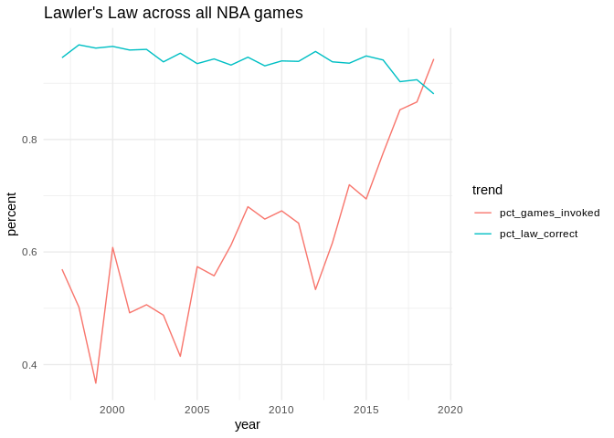
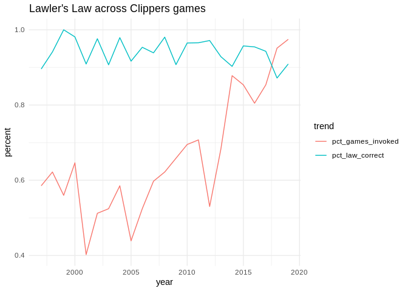
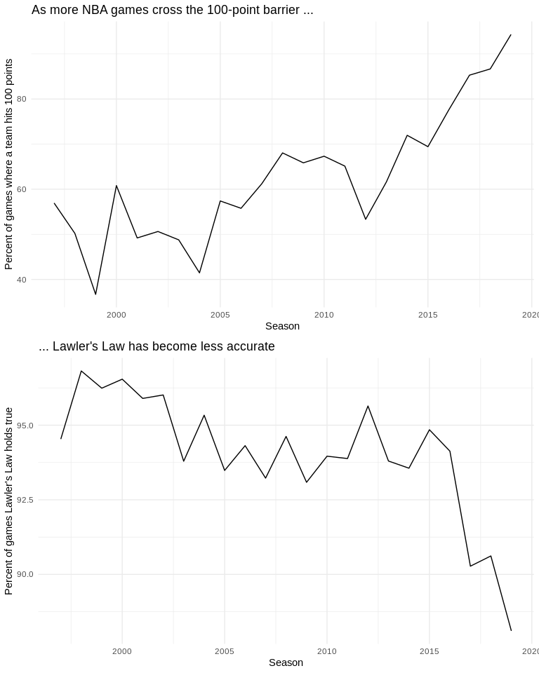
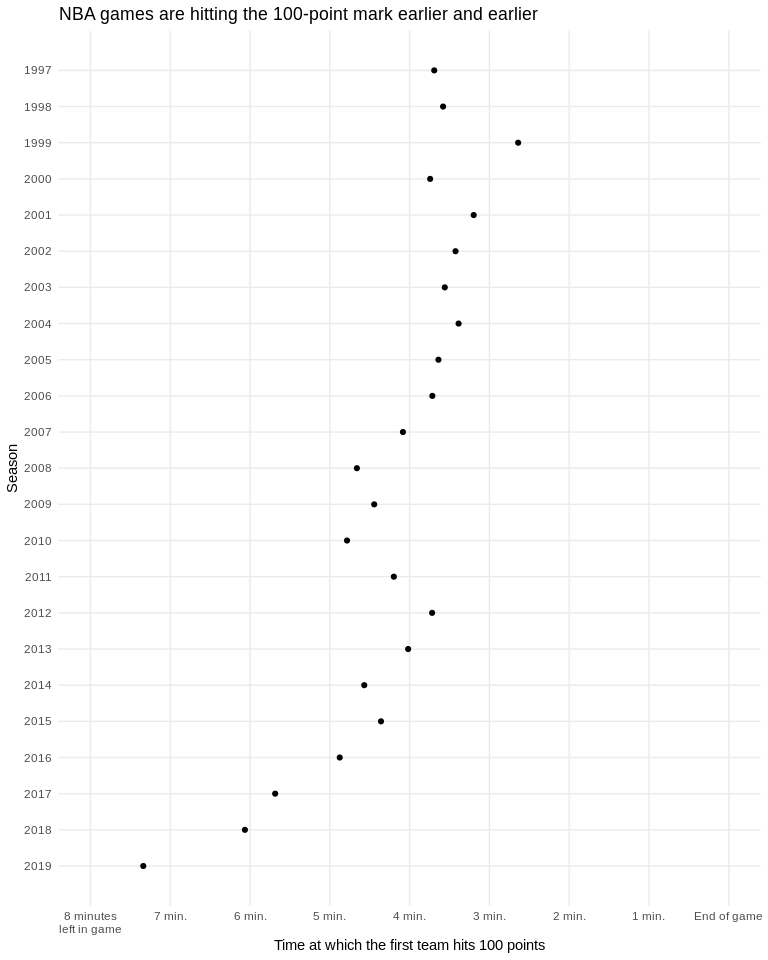
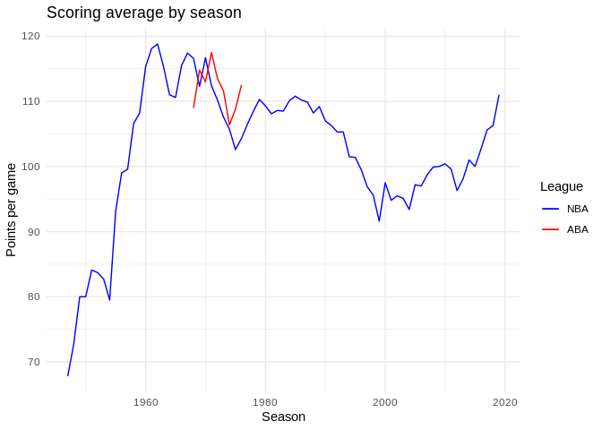

Lawler's Law: Plots
================

``` r
library(tidyverse)
```

    ## ── Attaching packages ─────────────────────────────────────────────────────────────────────────────────────────── tidyverse 1.2.1 ──

    ## ✔ ggplot2 3.1.0       ✔ purrr   0.3.0  
    ## ✔ tibble  2.0.1       ✔ dplyr   0.8.0.1
    ## ✔ tidyr   0.8.2       ✔ stringr 1.4.0  
    ## ✔ readr   1.3.1       ✔ forcats 0.3.0

    ## ── Conflicts ────────────────────────────────────────────────────────────────────────────────────────────── tidyverse_conflicts() ──
    ## ✖ dplyr::filter() masks stats::filter()
    ## ✖ dplyr::lag()    masks stats::lag()

### Lawler's Law

``` r
thelaw.nba = read_csv('analysis/law-calcs-nba.csv')
```

    ## Parsed with column specification:
    ## cols(
    ##   year = col_double(),
    ##   total_games = col_double(),
    ##   law_invoked = col_double(),
    ##   law_correct = col_double(),
    ##   pct_games_invoked = col_double(),
    ##   pct_law_correct = col_double()
    ## )

``` r
thelaw.lac = read_csv('analysis/law-calcs-lac.csv')
```

    ## Parsed with column specification:
    ## cols(
    ##   year = col_double(),
    ##   total_games = col_double(),
    ##   law_invoked = col_double(),
    ##   law_correct = col_double(),
    ##   pct_games_invoked = col_double(),
    ##   pct_law_correct = col_double()
    ## )

``` r
thelaw.nba %>% 
  select(-total_games:-law_correct) %>% 
  gather(-year, key = 'trend', value = 'percent') %>% 
  ggplot(aes(year, percent, color = trend)) +
  geom_line() +
  theme_minimal() +
  ggtitle("Lawler's Law across all NBA games")
```



``` r
thelaw.lac %>% 
  select(-total_games:-law_correct) %>% 
  gather(-year, key = 'trend', value = 'percent') %>% 
  ggplot(aes(year, percent, color = trend)) +
  geom_line() +
  theme_minimal() +
  ggtitle("Lawler's Law across Clippers games")
```



``` r
p1 = thelaw.nba %>% 
  ggplot(aes(year, pct_games_invoked * 100)) +
  geom_line() +
  theme_minimal() +
  xlab("Season") +
  ylab("Percent of games where a team hits 100 points") +
  ggtitle("As more NBA games cross the 100-point barrier ...")
p2 = thelaw.nba %>% 
  ggplot(aes(year, pct_law_correct * 100)) +
  geom_line() +
  theme_minimal() +
  xlab("Season") +
  ylab("Percent of games Lawler's Law holds true") +
  ggtitle("... Lawler's Law has become less accurate")
```

``` r
gridExtra::grid.arrange(p1, p2, ncol = 1)
```



### Time to 100

``` r
timeto100 = read_csv('analysis/time-to-100.csv')
```

    ## Parsed with column specification:
    ## cols(
    ##   year = col_double(),
    ##   avgtimeto100 = col_double()
    ## )

``` r
timeto100 %>% 
  ggplot(aes(avgtimeto100, year)) +
  geom_point() +
  ggtitle("NBA games are hitting the 100-point mark earlier and earlier") +
  scale_x_reverse(
    name = "Time at which the first team hits 100 points",
    breaks = rev(0:8*60),
    limits = c(8*60,0),
    labels = c('8 minutes\nleft in game','7 min.','6 min.','5 min.','4 min.','3 min.','2 min.','1 min.','End of game'),
    minor_breaks = NULL
  ) +
  scale_y_reverse(
    name = "Season",
    breaks = 2019:1997,
    limits = c(2019,1997),
    labels = 2019:1997,
    minor_breaks = NULL
  ) +
  theme_minimal()
```



### NBA historical scoring

Using data from basketball-reference.com

``` r
nba = read_csv('sportsref/nba_stats.csv')
```

    ## Parsed with column specification:
    ## cols(
    ##   .default = col_double(),
    ##   Season = col_character(),
    ##   Lg = col_character(),
    ##   Ht = col_character()
    ## )

    ## See spec(...) for full column specifications.

``` r
aba = read_csv('sportsref/aba_stats.csv')
```

    ## Parsed with column specification:
    ## cols(
    ##   .default = col_double(),
    ##   Season = col_character(),
    ##   Lg = col_character(),
    ##   Ht = col_character()
    ## )
    ## See spec(...) for full column specifications.

``` r
nbapts = nba %>% 
  select(szn = Season, pts = PTS) %>% 
  mutate(szn = as.integer(str_sub(szn, end=4)) + 1)
```

``` r
abapts = aba %>% 
  select(szn = Season, pts = PTS) %>% 
  mutate(szn = as.integer(str_sub(szn, end=4)) + 1)
```

``` r
nbapts %>% 
  left_join(abapts, by='szn', suffix = c('_nba','_aba')) %>% 
  ggplot(aes(szn)) +
  geom_line(aes(y = pts_nba, color = 'blue')) +
  geom_line(aes(y = pts_aba, color = 'red')) +
  scale_color_manual(name = 'League', values = c('blue'='blue','red'='red'), labels = c('NBA','ABA')) +
  xlab("Season") +
  ylab("Points per game") +
  ggtitle("Scoring average by season") +
  theme_minimal()
```

    ## Warning: Removed 64 rows containing missing values (geom_path).



``` r
  # geom_hline(yintercept = nbapts %>% filter(szn == 2019) %>% select(pts) %>% first(), color = 'blue')
```
