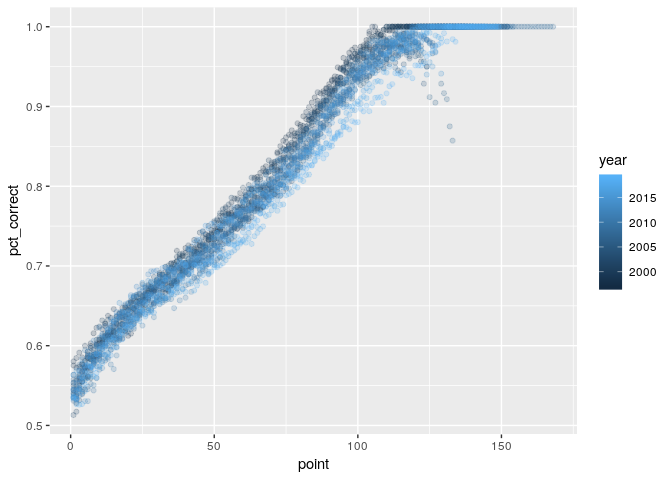
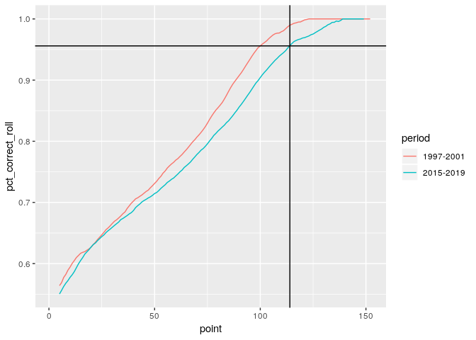

Lawler’s Law: An update
================

``` r
library(tidyverse)
```

    ## ── Attaching packages ───────────────────────────────────────────────────────── tidyverse 1.2.1 ──

    ## ✔ ggplot2 3.0.0     ✔ purrr   0.2.5
    ## ✔ tibble  1.4.2     ✔ dplyr   0.7.6
    ## ✔ tidyr   0.8.1     ✔ stringr 1.3.1
    ## ✔ readr   1.1.1     ✔ forcats 0.3.0

    ## ── Conflicts ──────────────────────────────────────────────────────────── tidyverse_conflicts() ──
    ## ✖ dplyr::filter() masks stats::filter()
    ## ✖ dplyr::lag()    masks stats::lag()

``` r
library(RcppRoll)
```

``` r
firsttox = read_csv('analysis/first-to-x-points.csv')
```

    ## Parsed with column specification:
    ## cols(
    ##   year = col_integer(),
    ##   point = col_integer(),
    ##   games = col_integer(),
    ##   correct = col_integer(),
    ##   pct_correct = col_double()
    ## )

``` r
head(firsttox)
```

    ## # A tibble: 6 x 5
    ##    year point games correct pct_correct
    ##   <int> <int> <int>   <int>       <dbl>
    ## 1  1997     1  1189     647       0.544
    ## 2  1997     2  1189     641       0.539
    ## 3  1997     3  1189     660       0.555
    ## 4  1997     4  1189     674       0.567
    ## 5  1997     5  1189     682       0.574
    ## 6  1997     6  1189     696       0.585

### Shift of the scoring curve over time

``` r
firsttox %>% 
  ggplot(aes(point, pct_correct, color = year)) +
  geom_point(alpha = 0.2) 
```

<!-- -->

``` r
# + stat_smooth(method = 'lm', formula = y ~ x + I(x^2) + I(x^3))
```

### Then

Group 1997 to 2001, a five-year period about 20 years ago. Calculate
some rolling averages for the percentage chance of a team winning for
getting to that point total.

``` r
firsttox %>% 
  filter(year <= 2001) %>% 
  group_by(point) %>% 
  summarise(games = sum(games), correct = sum(correct), pct_correct = correct / games) %>% 
  ggplot(aes(point, pct_correct)) +
  geom_line()
```

<!-- -->

This trend is a little jumpy. The real trend should be monotonically
increasing – for each increment in the point value, the percentage
chance that point total predicts the winner should not be lower than the
point total before.

Calculate rolling totals for total games and correct games for a moving
average.

``` r
firsttox.97.01 = firsttox %>% 
  filter(year <= 2001) %>% 
  group_by(point) %>% 
  summarise(games = sum(games), correct = sum(correct)) %>% 
  mutate(
    period = '1997-2001',
    pct_correct = correct / games,
    games_roll = roll_sum(games, 5, align = "right", fill = NA),
    correct_roll = roll_sum(correct, 5, align = "right", fill = NA),
    pct_correct_roll = correct_roll / games_roll
  )
```

What’s this trend look like?

``` r
firsttox.97.01 %>% 
  ggplot(aes(point, pct_correct_roll)) +
  geom_line()
```

    ## Warning: Removed 4 rows containing missing values (geom_path).

<!-- -->

Is the percentage at each point increasing (or the same) based on the
previous value?

``` r
firsttox.97.01 %>% 
  select(point, pct = pct_correct_roll) %>% 
  mutate(prevpct = lag(pct), diff = pct - prevpct, diffpositive = diff >= 0) %>% 
  filter(!diffpositive)
```

    ## # A tibble: 0 x 5
    ## # ... with 5 variables: point <int>, pct <dbl>, prevpct <dbl>, diff <dbl>,
    ## #   diffpositive <lgl>

It is. This is “monotonically increasing.”

What was the percentage chance of scoring 100 first and winning during
this period?

``` r
firsttox.97.01 %>% filter(point == 100)
```

    ## # A tibble: 1 x 8
    ##   point games correct period pct_correct games_roll correct_roll
    ##   <int> <int>   <int> <chr>        <dbl>      <dbl>        <dbl>
    ## 1   100  2848    2733 1997-…       0.960      16197        15483
    ## # ... with 1 more variable: pct_correct_roll <dbl>

95.6% across 16,197 games.

### Now

Compare to the most recent five-year period: 2015-2019.

``` r
firsttox.15.19 = firsttox %>% 
  filter(year >= 2015 & year <= 2019) %>% 
  group_by(point) %>% 
  summarise(games = sum(games), correct = sum(correct)) %>% 
  mutate(
    period = '2015-2019',
    pct_correct = correct / games,
    games_roll = roll_sum(games, 5, align = "right", fill = NA),
    correct_roll = roll_sum(correct, 5, align = "right", fill = NA),
    pct_correct_roll = correct_roll / games_roll
  )
```

Is this one monotonically increasing too?

``` r
firsttox.15.19 %>% 
  ggplot(aes(point, pct_correct_roll)) +
  geom_line()
```

    ## Warning: Removed 4 rows containing missing values (geom_path).

<!-- -->

``` r
firsttox.15.19 %>% 
  select(point, pct = pct_correct_roll) %>% 
  mutate(prevpct = lag(pct), diff = pct - prevpct, diffpositive = diff >= 0) %>% 
  filter(!diffpositive)
```

    ## # A tibble: 1 x 5
    ##   point   pct prevpct      diff diffpositive
    ##   <int> <dbl>   <dbl>     <dbl> <lgl>       
    ## 1   137 0.996   0.997 -0.000765 FALSE

Close enough.

What’s the success rate of 100 here?

``` r
firsttox.15.19 %>% filter(point == 100)
```

    ## # A tibble: 1 x 8
    ##   point games correct period pct_correct games_roll correct_roll
    ##   <int> <int>   <int> <chr>        <dbl>      <dbl>        <dbl>
    ## 1   100  5085    4644 2015-…       0.913      26740        24177
    ## # ... with 1 more variable: pct_correct_roll <dbl>

90% in 26,475 games. Makes sense: many more games and less success.

### The update

Compare the two monotonically increasing sequences. What was the
percentage chance of 100 predicting the winner in the first five-year
period? Take that value and find the first point value now that reaches
that threshold.

``` r
firsttox.15.19 %>% 
  arrange(point) %>% 
  filter(pct_correct_roll >= (
    firsttox.97.01 %>% 
      filter(point == 100) %>% 
      pull(pct_correct_roll)
    )
  ) %>% 
  slice(1)
```

    ## # A tibble: 1 x 8
    ##   point games correct period pct_correct games_roll correct_roll
    ##   <int> <int>   <int> <chr>        <dbl>      <dbl>        <dbl>
    ## 1   114  2257    2175 2015-…       0.964      13371        12789
    ## # ... with 1 more variable: pct_correct_roll <dbl>

The new magic number: 114.

This makes sense on a number of levels. It has roughly the same
predictive power, but is also not reached in every game. Lawler’s Law
worked well not because teams routinely hit 100 but because it was an
aspirational total. Teams hit 100 in about 75% of games in the first
five-year sample.

How do the two curves compare?

``` r
bind_rows(firsttox.97.01, firsttox.15.19) %>% 
  select(period, point, pct_correct_roll) %>% 
  ggplot(aes(point, pct_correct_roll, color = period)) +
  geom_line() +
  geom_hline(yintercept = 0.9559178) +
  geom_vline(xintercept = 114)
```

    ## Warning: Removed 8 rows containing missing values (geom_path).

<!-- -->
