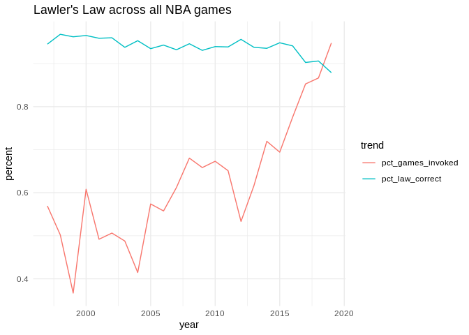
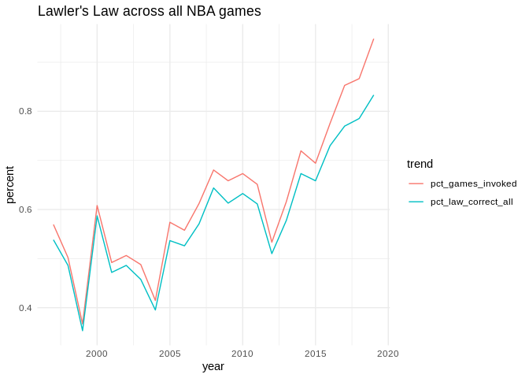

Lawler's Law: Plots
================

``` r
library(tidyverse)
```

### Accuracy of Lawler's Law

``` r
thelaw.nba = read_csv('analysis/law-calcs-nba.csv')
```

    ## Parsed with column specification:
    ## cols(
    ##   year = col_double(),
    ##   total_games = col_double(),
    ##   law_invoked = col_double(),
    ##   law_correct = col_double(),
    ##   pct_games_invoked = col_double(),
    ##   pct_law_correct = col_double()
    ## )

``` r
thelaw.lac = read_csv('analysis/law-calcs-lac.csv')
```

    ## Parsed with column specification:
    ## cols(
    ##   year = col_double(),
    ##   total_games = col_double(),
    ##   law_invoked = col_double(),
    ##   law_correct = col_double(),
    ##   pct_games_invoked = col_double(),
    ##   pct_law_correct = col_double()
    ## )

``` r
thelaw.nba
```

    ## # A tibble: 23 x 6
    ##     year total_games law_invoked law_correct pct_games_invok…
    ##    <dbl>       <dbl>       <dbl>       <dbl>            <dbl>
    ##  1  1997        1189         677         640            0.569
    ##  2  1998        1189         597         578            0.502
    ##  3  1999         725         266         256            0.367
    ##  4  2000        1189         723         698            0.608
    ##  5  2001        1189         585         561            0.492
    ##  6  2002        1189         602         578            0.506
    ##  7  2003        1189         580         544            0.488
    ##  8  2004        1189         493         470            0.415
    ##  9  2005        1230         706         660            0.574
    ## 10  2006        1230         686         647            0.558
    ## # … with 13 more rows, and 1 more variable: pct_law_correct <dbl>

``` r
colSums(thelaw.nba %>% select(total_games, law_invoked, law_correct))
```

    ## total_games law_invoked law_correct 
    ##       27258       17204       16100

How often was Lawler's Law correct in all NBA games?

``` r
sum(thelaw.nba$law_correct) / sum(thelaw.nba$law_invoked)
```

    ## [1] 0.9358289

``` r
thelaw.lac
```

    ## # A tibble: 23 x 6
    ##     year total_games law_invoked law_correct pct_games_invok…
    ##    <dbl>       <dbl>       <dbl>       <dbl>            <dbl>
    ##  1  1997          82          48          43            0.585
    ##  2  1998          82          51          48            0.622
    ##  3  1999          50          28          28            0.56 
    ##  4  2000          82          53          52            0.646
    ##  5  2001          82          33          30            0.402
    ##  6  2002          82          42          41            0.512
    ##  7  2003          82          43          39            0.524
    ##  8  2004          82          48          47            0.585
    ##  9  2005          82          36          33            0.439
    ## 10  2006          82          43          41            0.524
    ## # … with 13 more rows, and 1 more variable: pct_law_correct <dbl>

How often was Lawler's Law correct in Clippers games?

``` r
sum(thelaw.lac$law_correct) / sum(thelaw.lac$law_invoked)
```

    ## [1] 0.9378069

``` r
thelaw.nba %>% 
  select(-total_games:-law_correct) %>% 
  gather(-year, key = 'trend', value = 'percent') %>% 
  ggplot(aes(year, percent, color = trend)) +
  geom_line() +
  theme_minimal() +
  ggtitle("Lawler's Law across all NBA games")
```



``` r
thelaw.nba %>% 
  mutate(pct_law_correct_all = law_correct / total_games) %>% 
  select(-total_games:-law_correct, -pct_law_correct) %>% 
  gather(-year, key = 'trend', value = 'percent') %>% 
  ggplot(aes(year, percent, color = trend)) +
  geom_line() +
  theme_minimal() +
  ggtitle("Lawler's Law across all NBA games")
```



``` r
thelaw.lac %>% 
  select(-total_games:-law_correct) %>% 
  gather(-year, key = 'trend', value = 'percent') %>% 
  ggplot(aes(year, percent, color = trend)) +
  geom_line() +
  theme_minimal() +
  ggtitle("Lawler's Law across Clippers games")
```


``` r
p1 = thelaw.nba %>% 
  ggplot(aes(year, pct_games_invoked * 100)) +
  geom_line() +
  theme_minimal() +
  xlab("Season") +
  ylab("Percent of games where a team hits 100 points") +
  ggtitle("As more NBA games cross the 100-point barrier ...")
p2 = thelaw.nba %>% 
  ggplot(aes(year, pct_law_correct * 100)) +
  geom_line() +
  theme_minimal() +
  xlab("Season") +
  ylab("Percent of games Lawler's Law holds true") +
  ggtitle("... Lawler's Law has become less accurate")
```

``` r
gridExtra::grid.arrange(p1, p2, ncol = 1)
```


### Time to 100

``` r
timeto100 = read_csv('analysis/time-to-100.csv')
```

    ## Parsed with column specification:
    ## cols(
    ##   year = col_double(),
    ##   avgtimeto100 = col_double()
    ## )

``` r
timeto100 %>% 
  ggplot(aes(avgtimeto100, year)) +
  geom_point() +
  ggtitle("NBA games are hitting the 100-point mark earlier and earlier") +
  scale_x_reverse(
    name = "Time at which the first team hits 100 points",
    breaks = rev(0:8*60),
    limits = c(8*60,0),
    labels = c('8 minutes\nleft in game','7 min.','6 min.','5 min.','4 min.','3 min.','2 min.','1 min.','End of game'),
    minor_breaks = NULL
  ) +
  scale_y_reverse(
    name = "Season",
    breaks = 2019:1997,
    limits = c(2019,1997),
    labels = 2019:1997,
    minor_breaks = NULL
  ) +
  theme_minimal()
```


### NBA historical scoring

Using data from basketball-reference.com

``` r
nba = read_csv('sportsref/nba_stats.csv')
```

    ## Parsed with column specification:
    ## cols(
    ##   .default = col_double(),
    ##   Season = col_character(),
    ##   Lg = col_character(),
    ##   Ht = col_character()
    ## )

    ## See spec(...) for full column specifications.

``` r
aba = read_csv('sportsref/aba_stats.csv')
```

    ## Parsed with column specification:
    ## cols(
    ##   .default = col_double(),
    ##   Season = col_character(),
    ##   Lg = col_character(),
    ##   Ht = col_character()
    ## )
    ## See spec(...) for full column specifications.

``` r
nbapts = nba %>% 
  select(szn = Season, pts = PTS) %>% 
  mutate(szn = as.integer(str_sub(szn, end=4)) + 1)
```

``` r
abapts = aba %>% 
  select(szn = Season, pts = PTS) %>% 
  mutate(szn = as.integer(str_sub(szn, end=4)) + 1)
```

``` r
nbapts %>% 
  left_join(abapts, by='szn', suffix = c('_nba','_aba')) %>% 
  ggplot(aes(szn)) +
  geom_line(aes(y = pts_nba, color = 'blue')) +
  geom_line(aes(y = pts_aba, color = 'red')) +
  scale_color_manual(name = 'League', values = c('blue'='blue','red'='red'), labels = c('NBA','ABA')) +
  xlab("Season") +
  ylab("Points per game") +
  ggtitle("Scoring average by season") +
  theme_minimal()
```

    ## Warning: Removed 64 rows containing missing values (geom_path).


